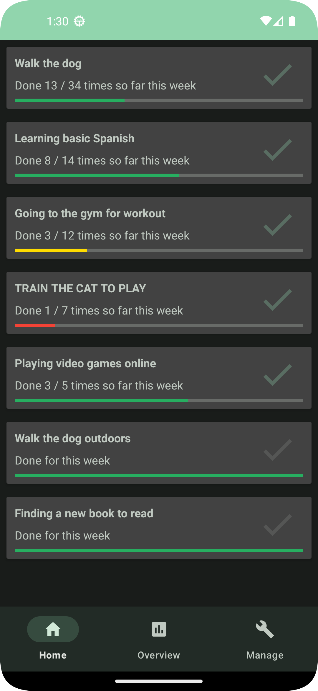
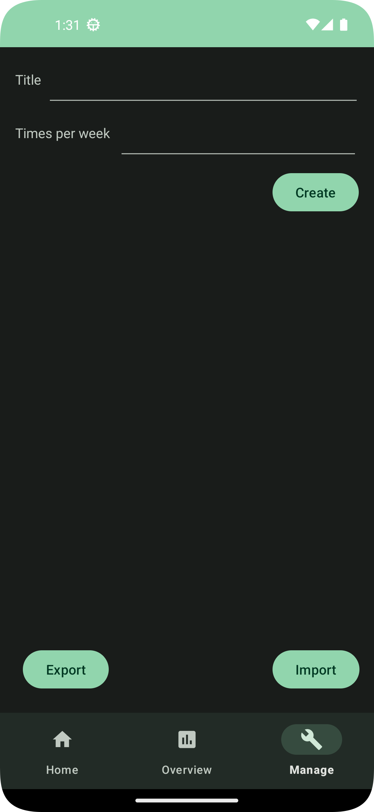

🔁 Habitic
[](https://github.com/meenbeese/Habitic/actions)
[](https://liberapay.com/meenbeese/)
=======

[](https://forthebadge.com)
[](https://forthebadge.com)
[](https://forthebadge.com)

**Habitic is a simple habit tracker that places simplicity above all else while still providing granular controls and functionality.**

## 🌄 Screenshots

| Home                                                               | Overview                                                           |
|--------------------------------------------------------------------|--------------------------------------------------------------------|
|      |  |

| Settings                                                           | Export                                                             |
|--------------------------------------------------------------------|--------------------------------------------------------------------|
|  |    |

## ⭐ Features

- Ability to add, and edit habits with customizable frequency (per week)
- Daily push notification reminders to fill out habit status
- Summary view to track and assess your habit formations
- Color-coded progress bars on habits to identify which ones you're behind on
- Ability to archive habits after they've formed, or to stop tracking them
- Ability to tweak (add, adjust time, or delete) all logged events
- Log events marked "Done" near midnight to the previous day
- Ability to export or import all information from the app to and from a CSV
- These are done while requesting minimal permissions and respecting user privacy

## 📲 Installation
     
[](https://f-droid.org/packages/me.jfenn.Alarmic/)
[]((../../releases/))

## ✅ Ways of Support

Not everyone has the time or technical knowledge to help out with many of the above - we understand that. With this in mind, here are a few other ways to help us out that don't require as much time or dedication.

- **💈 Advertising:** Spread the word to your friends or on your social media of choice! If you like what we're doing here, getting more people involved is the best way to help improve it.
- **💵 Donations:** I've invested a lot of my free time into this app. Feel free to check out my [Liberapay](https://liberapay.com/meenbeese/) and donate any amount you are able to!
- **📢 Politics:** Free software is, in fact, a very political thing. Consider supporting FOSS applications and services over their proprietary counterparts whenever you can.

## 📝 Contributions

Habitic is written by users - everyone working on this project (including myself) is motivated entirely by their own needs and ideals. There is no professional support line to handle complaints or paid development team to fix bugs. Anyone that volunteers their time and expertise to improve this app does so without any obligation or commitment to the users of this software.

As a contributor, you are highly valued - any contribution, no matter how small, misled, or incorrectly formatted, is welcome. We'd much prefer to work together and resolve an issue than turn any genuine effort away. **If you need help with this process, have any questions or confusion, or want to get feedback before a contribution, please don't hesitate to get in touch.**

- **🖥️ Development:** Developers can help Habitic by [fixing bugs](https://github.com/meenbeese/Habitic/issues), implementing features, or helping to debug & research new issues. After reviewing [CONTRIBUTING.md](./.github/CONTRIBUTING.md), you can open a PR request which will be reviewed. If it looks good to me, I will merge it into the main branch.
- **🍥 Designing:** Habitic should be intuitive and accessible to a wide variety of users - suggestions to improve certain interfaces are always welcome. This includes compatibility with screen readers, problems with contrast / color blindness, and the sizing/positioning of touch targets in the app - many of which are shamefully untested in Habitic's present state.
- **🤝 Helping users:** Often times, issues are created that go untouched for a couple days due to various factors, when they could be resolved immediately. Responding to obvious questions and identifying duplicate issues can be immensely helpful in reducing the workload on other maintainers and developers.
- **📂 Filing issues:** Accurately reporting bugs and edge cases you experience can drastically reduce the amount of work we need to do to identify a problem. Providing relevant info - the device name & manufacturer, Android version, the version of Alarmic the bug was encountered in, and a thorough description helps others to understand what the issue is and how it could be solved. If you want to go the extra mile, screen recordings and logcat info are often immensely helpful. Don't forget to check for existing similar issues though!
- **🌍 Localization:** If Habitic doesn't have support for your fluent language(s), please consider translating it! Most in-app text is stored in [strings.xml](./app/src/main/res/values/strings.xml) - this file should be copied to `../values-{lang}/strings.xml` when translated. (this is an absurdly concise explanation - if this isn't clear, simply sending us translations in a new issue or email is perfectly fine!)
- **📄 Documentation:** Writing guides and explanations of how Habitic works, how to use it, and how to contribute to it, can go a long way to ensuring its usefulness and stability in the future. Whether this involves an update to the README, a tutorial for users and contributors, or adding Javadocs & comments to undocumented functions in the app - anything is valid!

## ✏️ Acknowledgements

I would like to give a huge thanks to all of Habitic [contributors](https://github.com/fennifith/Alarmic/graphs/contributors), the developers that write the software we depend on, and the users that support our goal. Also, props to [F-Droid](https://f-droid.org/en/about/) for maintaining the free software repository that distributes our app and many others like it.

I have received a lot of thanks from various people for the time I've put into this, and that thought helps me get up in the morning. If someone fixes a bug you encountered, helps you out in an issue, or implements a feature you enjoy, please consider sending them a tip or a thank-you note to let them know that you appreciate their time :)

## 🏗️ Building From Source

You need Android Studio to build this App.
After Installing Android Studio, select `Project` from `Version Control` and paste the link of this repository.
Navigate to `Build > APK > Create New Keystore > Enter the password` and wait for the build to finish.

## 📝 License

```
MIT License

Copyright (c) 2023 Meenbeese

Permission is hereby granted, free of charge, to any person obtaining a copy
of this software and associated documentation files (the "Software"), to deal
in the Software without restriction, including without limitation the rights
to use, copy, modify, merge, publish, distribute, sublicense, and/or sell
copies of the Software, and to permit persons to whom the Software is
furnished to do so, subject to the following conditions:

The above copyright notice and this permission notice shall be included in all
copies or substantial portions of the Software.

THE SOFTWARE IS PROVIDED "AS IS", WITHOUT WARRANTY OF ANY KIND, EXPRESS OR
IMPLIED, INCLUDING BUT NOT LIMITED TO THE WARRANTIES OF MERCHANTABILITY,
FITNESS FOR A PARTICULAR PURPOSE AND NONINFRINGEMENT. IN NO EVENT SHALL THE
AUTHORS OR COPYRIGHT HOLDERS BE LIABLE FOR ANY CLAIM, DAMAGES OR OTHER
LIABILITY, WHETHER IN AN ACTION OF CONTRACT, TORT OR OTHERWISE, ARISING FROM,
OUT OF OR IN CONNECTION WITH THE SOFTWARE OR THE USE OR OTHER DEALINGS IN THE
SOFTWARE.
```
